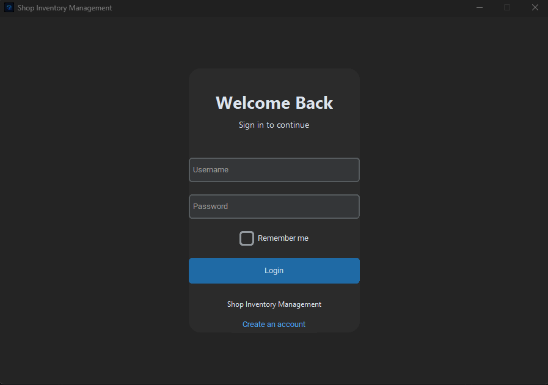
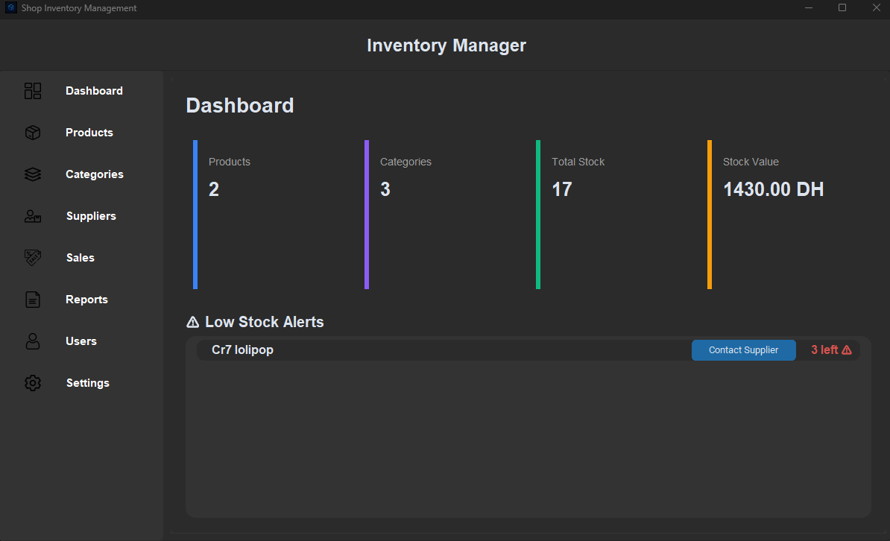
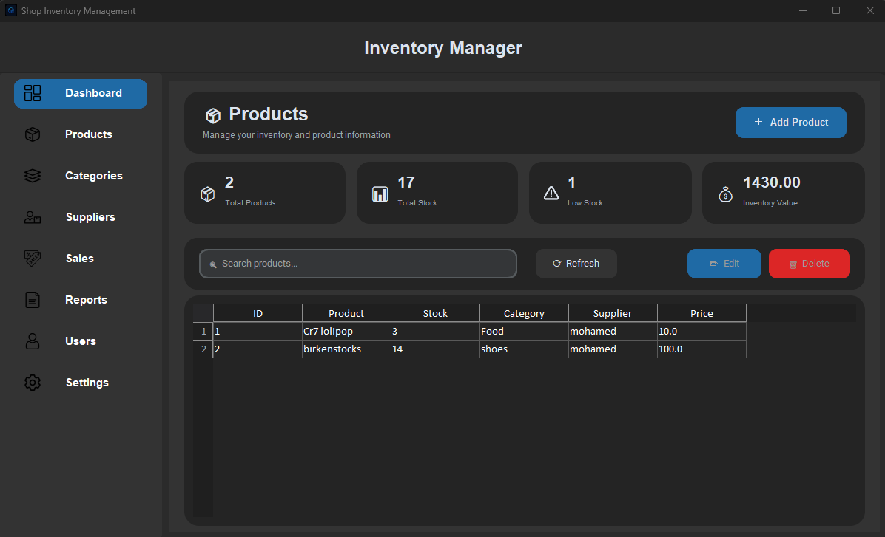
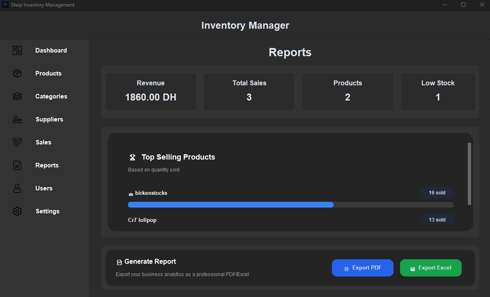
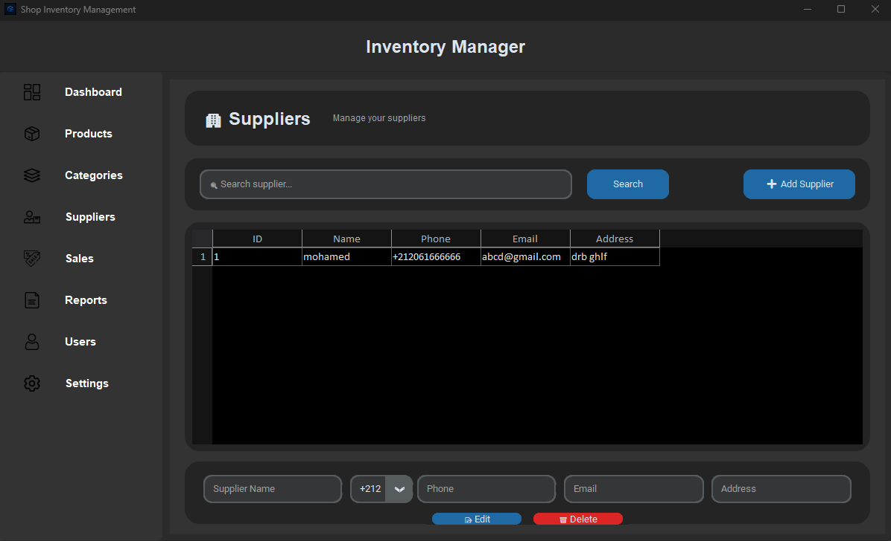

# 🛒 Shop Inventory Manager

A modern desktop **Inventory Management System** built with **Python, CustomTkinter, SQLite, and tksheet**.

Designed to help small shops manage their products, suppliers, categories, sales, stock levels, and business reports through a clean and easy-to-use interface.

---

## ✨ Features

### 🔐 Authentication

* Secure login system
* User accounts and roles
* Default administrator account

### 📦 Product Management

* Add new products
* Edit existing products
* Delete products
* Track product quantities
* Assign categories and suppliers
* Manage product prices

### 🏷️ Categories

* Create categories
* Edit categories
* Delete categories
* View product counts by category

### 🚚 Supplier Management

* Add suppliers
* Edit supplier information
* Delete suppliers
* Store phone numbers, emails, and addresses
* Search suppliers

### 💰 Sales Management

* Select products for sale
* Adjust quantities
* Automatically calculate total prices
* Automatically update stock after a sale
* View complete sales history
* Delete sales

### 📊 Dashboard & Reports

* Total products
* Total sales
* Total revenue
* Low-stock products
* Most-sold products
* Business statistics

### 📉 Stock Management

* Real-time stock tracking
* Low-stock detection
* Automatic stock updates after sales
* Out-of-stock protection

### 🎨 Modern Interface

* Built with CustomTkinter
* Dark-themed interface
* Modern buttons and layouts
* Interactive tables powered by tksheet
* Responsive application layout

---

## 🛠️ Technologies

| Technology       | Purpose                   |
| ---------------- | ------------------------- |
| 🐍 Python        | Main programming language |
| 🎨 CustomTkinter | Modern GUI                |
| 📋 tksheet       | Interactive data tables   |
| 🗄️ SQLite       | Local database            |
| 🖼️ Pillow       | Image processing          |
| 📅 datetime      | Date and time handling    |

---

## 📁 Project Structure

```text
inventory-manager/
│
├── main.py              # Application entry point
├── database.py          # Database operations
├── login.py             # Login interface
├── dashboard.py         # Main dashboard
├── products.py          # Product management
├── categories.py        # Category management
├── suppliers.py         # Supplier management
├── sales.py             # Sales management
├── reports.py           # Reports and statistics
│
├── shop.db              # SQLite database
├── requirements.txt     # Python dependencies
├── README.md            # Project documentation
└── .gitignore           # Git ignore rules
```

> File names may vary depending on the final project structure.

---

## 🚀 Installation

### 1. Clone the repository

```bash
git clone https://github.com/YOUR-USERNAME/YOUR-REPOSITORY.git
cd YOUR-REPOSITORY
```

### 2. Create a virtual environment

```bash
python -m venv venv
```

Activate it on Windows:

```bash
venv\Scripts\activate
```

### 3. Install dependencies

```bash
pip install -r requirements.txt
```

### 4. Run the application

```bash
python main.py
```

---

## 🔑 Default Login

The application creates a default administrator account when the database is initialized.

```text
Username: admin
Password: admin123
```

> **For production use, change the default credentials.**

---

## 🗄️ Database

The application uses **SQLite**, so no external database server is required.

The database stores information such as:

* Users
* Products
* Categories
* Suppliers
* Sales

The database is automatically initialized when the application starts.

---

## 🖥️ Screenshots

Add screenshots of your application here:

### Login



### Dashboard



### Products



### Sales



### Suppliers



---

## 📋 Requirements

* Python **3.10+**
* Windows / Linux / macOS
* Required Python packages listed in `requirements.txt`

Install everything with:

```bash
pip install -r requirements.txt
```

---

## 🎯 Project Goals

This project was built to practice and demonstrate:

* Python application development
* Object-Oriented Programming
* GUI development
* SQLite database management
* CRUD operations
* Database relationships
* User authentication
* Data validation
* Inventory management logic
* Sales processing
* Software organization

---

## 🔮 Future Improvements

Possible features for future versions:

* [ ] Barcode scanning
* [ ] Product images
* [ ] PDF reports
* [ ] Excel export
* [ ] Receipt printing
* [ ] Database backup & restore
* [ ] WhatsApp supplier contact
* [ ] Advanced analytics
* [ ] Multi-user permissions
* [ ] Cloud database
* [ ] Web-based version

---

## 📌 Version

**v1.0.0 — Initial Release**

The first complete version of the Shop Inventory Manager.

---

## 👨‍💻 Author

**from0to-boi**

Built with Python 🐍

---

## ⭐ Support

If you found this project useful or interesting, consider giving the repository a ⭐ on GitHub.
